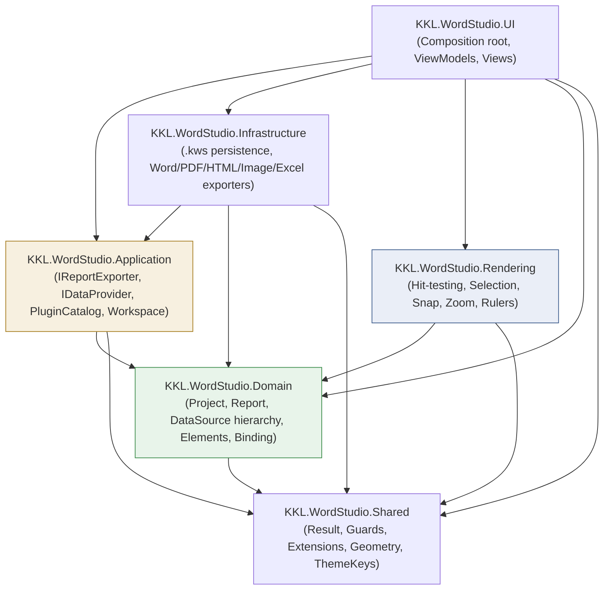
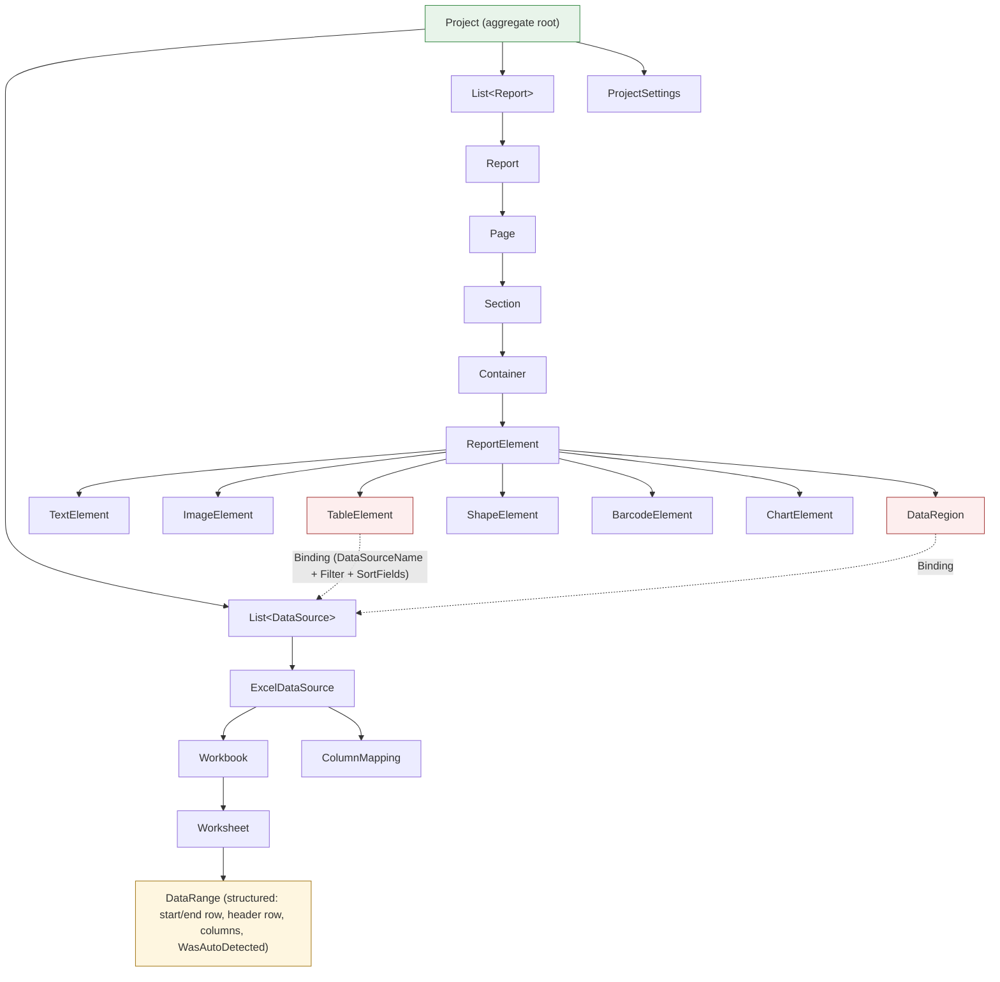

# KKL Word Studio — Architecture Diagram (post Sprint 2)

## Layer dependency graph

Note: `Rendering` never references `Application` — enforced by ADR 0002.
`Domain` never references `Application`/`Infrastructure` — enforced by ADR 0001/0003.

## Domain model (post ADR 0004 / Sprint 2)

`Binding` (Sprint 2) now carries `Filter` (an `Expression`, reused from the
element-binding mechanism already used for cell content) and `SortFields`
(structured `SortField` list) — but deliberately not Worksheet/DataRange/
ColumnMapping, which stay resolved once at the DataSource level (ADR 0004).

## Excel import flow (Sprint 2 end-to-end path)

`IExcelWorkbookReader` (Application) / `OpenXmlExcelWorkbookReader`
(Infrastructure) implement steps A–E using the OpenXML SDK — the same
package already planned for Word export, so no new dependency was added.

